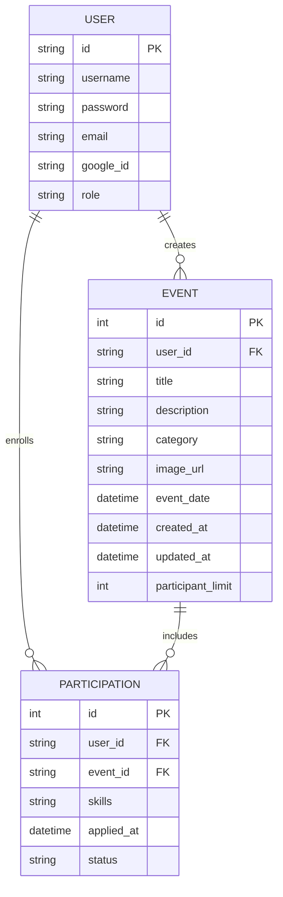
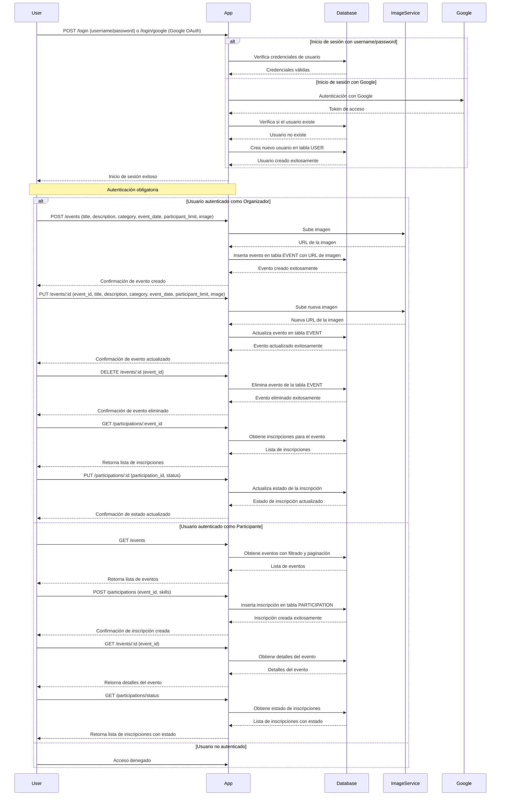

# Exclusive Events Platform

## Descripción

Exclusive Events Platform es una plataforma en línea que permite a los usuarios crear y gestionar eventos exclusivos. Los usuarios pueden inscribirse en estos eventos especificando sus habilidades, y los organizadores pueden aceptar o rechazar las solicitudes de participación. Los eventos tienen un límite de participación y solo se seleccionan los usuarios más adecuados.

## Características

- **Gestión de Usuarios**: Registro e inicio de sesión utilizando username y password, así como autenticación con redes sociales (Google).
- **Gestión de Roles**: Roles de organizador y participante.
- **Gestión de Eventos**: Creación, actualización y eliminación de eventos por parte de los organizadores.
- **Inscripción a Eventos**: Inscripción de participantes en los eventos mencionando sus habilidades.
- **Filtrado y Paginación**: Búsqueda de eventos y navegación a través de los resultados.
- **Notificaciones**: Envío de notificaciones a los participantes sobre la aceptación o rechazo de su inscripción.
- **Límite de Participación**: Establecimiento de un límite máximo de participantes por evento.

## Requisitos
- Cualquier framework de tu elección tanto para Backend como para Frontend.
- Para el Backend, se recomienda usar PostgreSQL como base de datos, pero se puede usar cualquier otra base de datos relacional.

## Diagrama Entidad-Relación (ER)

## Diagrama de Secuencia

## Referencia para el Frontend

### Páginas y Componentes

1. **Home Page**:
   - Página inicial de la aplicación con eventos destacados y recomendaciones.

2. **Página de Inicio de Sesión**:
   - Formulario de inicio de sesión con username y password.
   - Botones para iniciar sesión con Google.

3. **Lista de Eventos**:
   - Tabla o lista que muestra todos los eventos.
   - Funcionalidades de filtrado y paginación.
   - Botones para ver detalles e inscribirse en cada evento.

4. **Detalle del Evento**:
   - Mostrar información detallada del evento seleccionado.
   - Opción para volver a la lista de eventos.

5. **Formulario de Evento** (solo para organizadores):
   - Formulario para crear o editar un evento.
   - Campos para título, descripción, categoría, fecha del evento, límite de participantes e imagen.
   - Botón de guardar o actualizar evento.

6. **Admin Panel** (solo para organizadores):
   - Panel de administración para gestionar eventos y revisar inscripciones.

7. **Página de Inscripciones**:
   - Lista de inscripciones realizadas por el usuario.
   - Estado de cada inscripción (pendiente, aceptada, rechazada).

### Ejemplos Visuales

- **Home Page**:
  [Inserta aquí una imagen representativa de la Home Page]

- **SignUp/SignIn**:
  

- **Gestor de Eventos**:
  

## Ejemplos de Eventos

1. **Eventos de Juegos**:
   - Torneos de videojuegos.
   - Maratones de juegos.
   - Sesiones de juego colaborativas.

2. **Eventos Profesionales**:
   - Conferencias y seminarios.
   - Talleres de capacitación.
   - Reuniones de networking.

3. **Eventos Sociales**:
   - Reuniones de clubes y asociaciones.
   - Eventos de voluntariado.
   - Encuentros culturales y artísticos.

4. **Eventos Deportivos**:
   - Torneos de deportes.
   - Clases de fitness y bienestar.
   - Campamentos de entrenamiento.