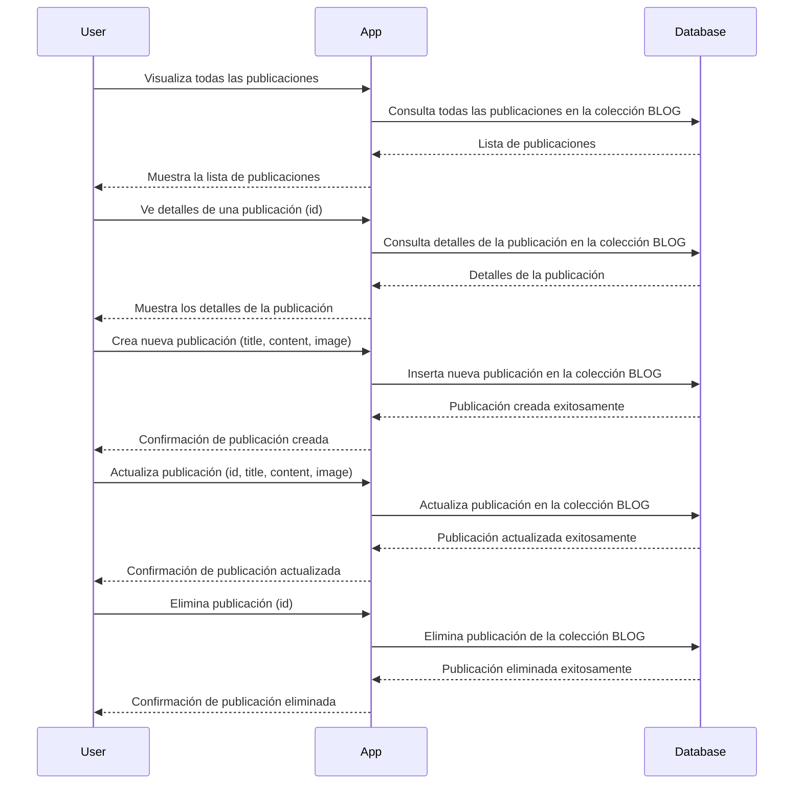
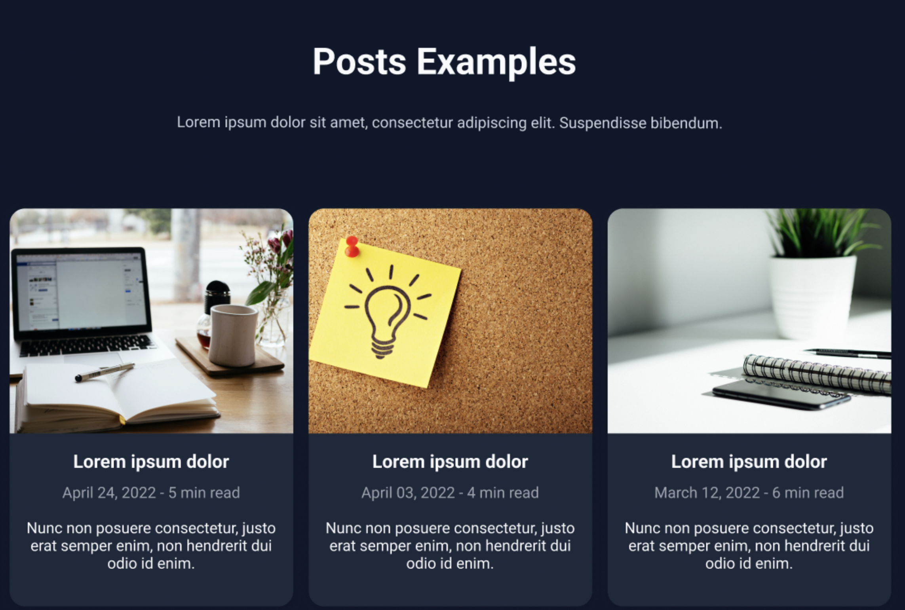

# Personal Blog App

## Descripción

Esta aplicación es un sistema de blog personal que permite a los usuarios crear, editar y eliminar publicaciones de blog. Los usuarios pueden ver todas las publicaciones existentes y acceder a los detalles de cada una.

## Características

- **Gestión de Publicaciones**: Creación, actualización y eliminación de publicaciones de blog.
- **Visualización de Publicaciones**: Visualización de todas las publicaciones y detalles de cada una.

## Requisitos

- Cualquier framework de tu elección tanto para Backend como para Frontend.
- MongoDB como base de datos.

## Esquema de la Base de Datos

```json
{
  "collections": {
    "blogs": {
      "fields": {
        "id": "ObjectId",
        "title": "string",
        "content": "string",
        "imagen" : "string",
        "createdAt": "datetime",
        "updatedAt": "datetime"
      }
    }
  }
}
```

## Diagrama de Secuencia

## Diseño de referencia para el Frontend


