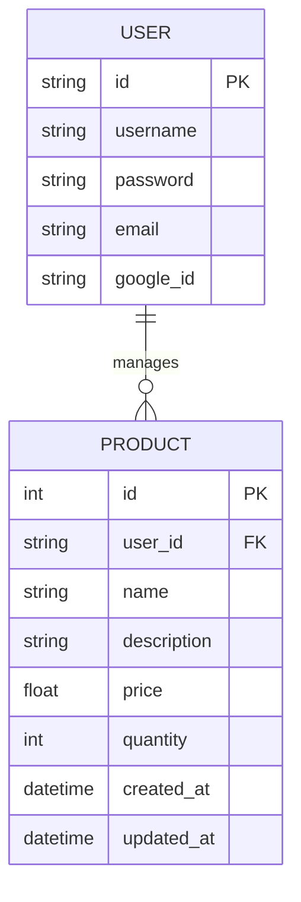
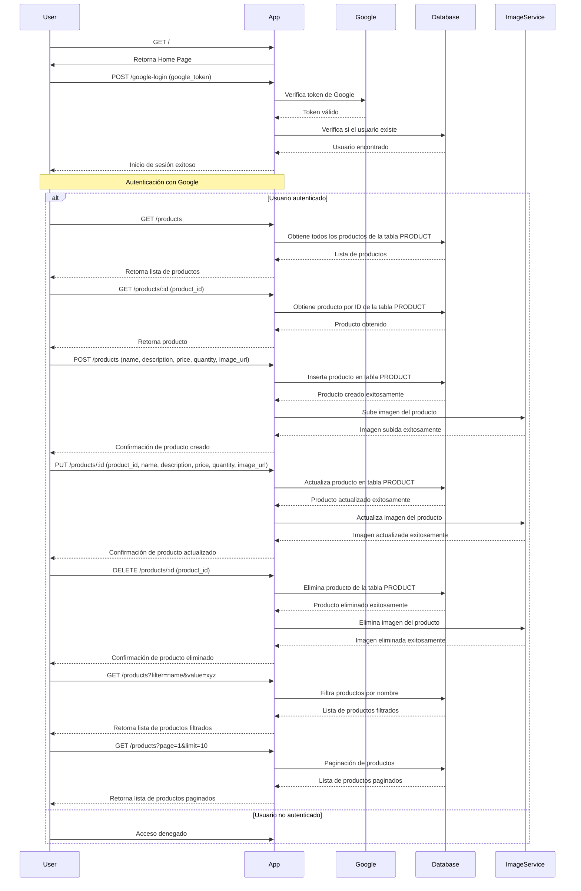

# API RESTful para Gestión de Productos

## Descripción

Esta aplicación es un sistema de gestión de productos en un inventario. Permite a los usuarios gestionar productos, incluyendo la creación, lectura, actualización y eliminación de productos. La aplicación también proporciona funcionalidades de filtrado y paginación para mejorar la usabilidad de la API.

## Características

- **Gestión de Productos**: Crear, leer, actualizar y eliminar productos.
- **Filtrado y Paginación**: Mejorar la usabilidad de la API mediante la implementación de filtros y paginación.
- **Autenticación con Google**: Inicio de sesión mediante autenticación con Google.
- **Home Page**: Página inicial de la aplicación.
- **Admin Panel**: Panel de administración para gestionar usuarios y productos.
- **Servicio de Imágenes**: Integración con un servicio de imágenes para manejar imágenes de productos.

## Requisitos

- Cualquier framework de tu elección tanto para el backend como para el frontend.
- En el backend, se recomienda el uso de PostgreSQL, pero se puede usar cualquier otra base de datos relacional.

## Diagrama Entidad-Relación (ER)

## Diagrama de Secuencia.

## Referencia para el Frontend

### Páginas y Componentes

1. **Home Page**:
   - Página inicial de la aplicación.

2. **Página de Inicio de Sesión con Google**:
   - Botón para iniciar sesión con Google.

3. **Página de Registro e Inicio de Sesión**:
   - Formulario de registro (username, email, password).
   - Formulario de inicio de sesión (username, password).
   - Manejo de errores y validaciones.

4. **Lista de Productos**:
   - Tabla o lista que muestra todos los productos.
   - Funcionalidades de filtrado y paginación.
   - Botones para ver, editar y eliminar cada producto.

5. **Detalle del Producto**:
   - Mostrar información detallada del producto seleccionado.
   - Opción para volver a la lista de productos.

6. **Formulario de Producto**:
   - Formulario para crear o editar un producto.
   - Campos para nombre, descripción, precio y cantidad.
   - Botón de guardar o actualizar producto.

7. **Admin Panel**:
   - Panel de administración para gestionar usuarios y productos.

### Ejemplos Visuales

- **Home Page**:
  [Inserta aquí una imagen representativa de la Home Page]

- **SignUp/SignIn**:
  

- **Gestor de Productos**:
  

## Recomendaciones Adicionales

- **Autenticación y Autorización**: Implementar autenticación basada en tokens (JWT) para asegurar que solo los usuarios autenticados puedan gestionar productos.
- **Validación de Datos**: Asegurarse de que todos los datos enviados por los usuarios sean válidos y seguros.
- **Documentación**: Utilizar herramientas como Swagger para documentar la API y facilitar su uso a otros desarrolladores.
- **Pruebas**: Implementar pruebas unitarias y de integración para asegurar la calidad del código y la funcionalidad de la aplicación.
- **Despliegue**: Considerar el despliegue en servicios de hosting como Heroku, AWS o Vercel para que la aplicación esté disponible públicamente.

Esta estructura te ayudará a crear una aplicación de gestión de productos robusta y escalable, adecuada para aprender y mejorar habilidades en desarrollo web.
