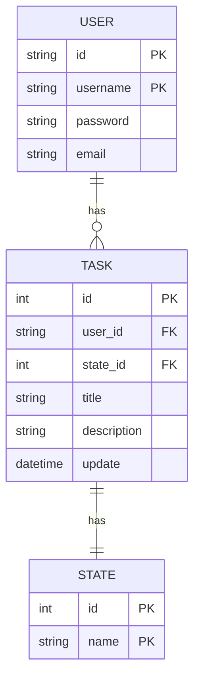
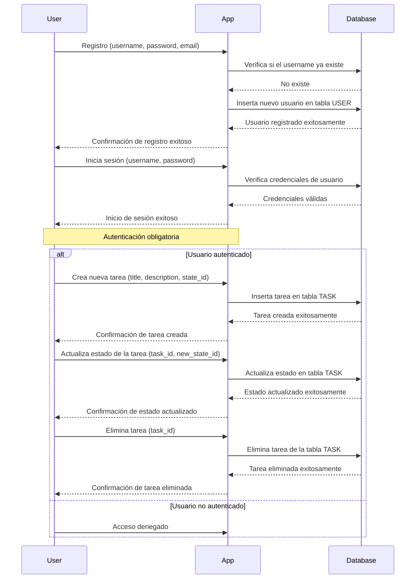
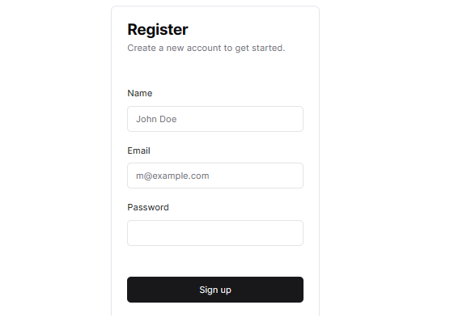
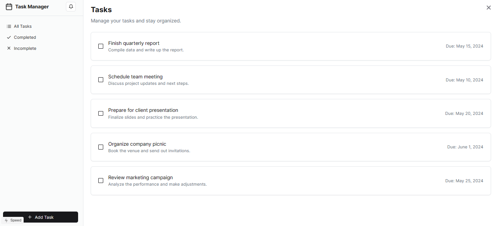

# Task Management App

## Descripción

Esta aplicación es un sistema de gestión de tareas que permite a los usuarios crear y gestionar tareas. Cada tarea tiene un estado asociado y está asignada a un usuario específico.

## Características

- **Gestión de Usuarios**: Registro, inicio de sesión y autenticación de usuarios.
- **Gestión de Tareas**: Creación, actualización y eliminación de tareas.
- **Gestión de Estados**: Cada tarea tiene un estado que puede ser actualizado.

## Requisitos
- Cualquier framework de tu elección tanto para Back como para Front
- En caso estes realizando el Backend para este proyecto se decidió usar PostgreSQL pero se puede usar cualquier otra base de datos relacional

## Diagrama Entidad-Relación (ER)

## Diagrama de Secuencia

## Diseño de referencia para el Frontend

- **SignUp/SignIn**:
  

- **Gestor de Tareas**:
  